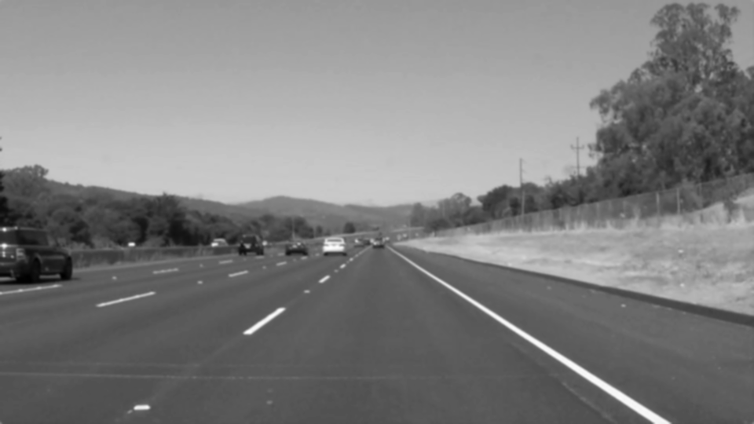
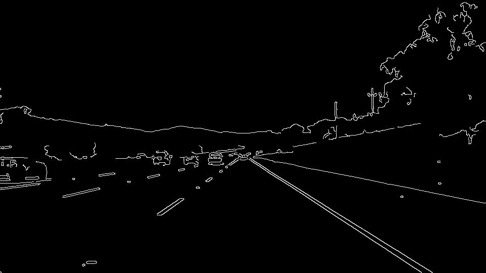
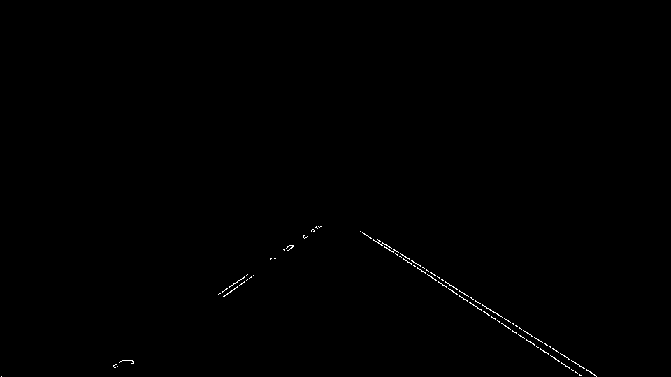
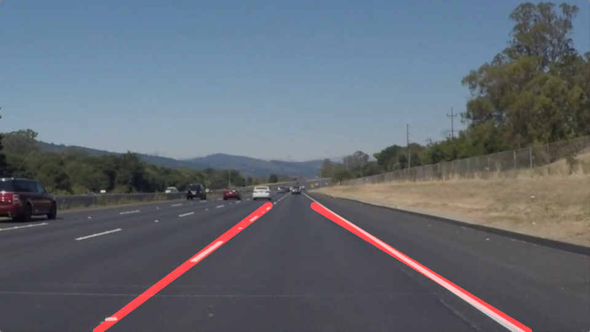

**Finding Lane Lines on the Road**

### Reflection

### 1. Describe your pipeline. As part of the description, explain how you modified the draw_lines() function.

  We will through an example to detail the process.
  [example](https://github.com/aman-ahluwalia/LaneLines/blob/master/test_images/solidWhiteRight.jpg) "Example"
  

  My Pipeline consisted of 6 steps.
  Firstly i have converted the image to a grayscale image.
  [grayscale](https://github.com/aman-ahluwalia/LaneLines/blob/master/test_images_output/1_solidWhiteRight.jpg) "Grayscale"
  

  Then i applied the gaussian smoothing on the grayed scale image.  
  [gaussian_smoothing](https://github.com/aman-ahluwalia/LaneLines/blob/master/test_images_output/2_solidWhiteRight.jpg) "Gaussian Smoothing"
  

  Then i applied canny transform on the above image.
  [canny](https://github.com/aman-ahluwalia/LaneLines/blob/master/test_images_output/3_solidWhiteRight.jpg) "Canny"
  

  Further i created the masked edges image, to create our region of interest, in order to restrict the area where the lines should be drawn. Only keeps the region of the image defined by the polygon. The rest of the image is set to black.
  [masked_edges](https://github.com/aman-ahluwalia/LaneLines/blob/master/test_images_output/4_solidWhiteRight.jpg) "Masked Edges"
  

  Now using the above image we will determine the hough lines and drew it on a blank image of same size.
  But the transform will give many lines, but we actually intended to find just two lines, i.e. one for left lane and one for right.
  Hence in order to achieve the above goal i modified the draw_lines() function.
  Firstly i need to separate the left line from right line we used the slope as our key component for the purpose, i.e. if slope is negative then it is in the left line bucket and if positive then it lies in right line bucket.
  Then i used the divided buckets in similar track to draw the respective lines. In each bucket, i calculated the mean slope of all the lines in the bucket. Then i calculated the mean point. With help of that and calculating y according to image size i computed the top and bottom points of the line. Then to remove flicker i did the weighted average over the last frames (affect will be clearly visible in the video) by creating a class called Line, which consists of two 2D lists.
  [hough_lines](https://github.com/aman-ahluwalia/LaneLines/blob/master/test_images_output/5_solidWhiteRight.jpg) "Hough Lines"
  

  Lastly we will try to make these hough lines on the original image by combining the above hough line image with the original image.
  [final_image](https://github.com/aman-ahluwalia/LaneLines/blob/master/test_images_output/5_solidWhiteRight.jpg) "Final Image"
  

### 2. Identify potential shortcomings with your current pipeline

  One of the shortcoming can be if the corners of the road are also straight lines, then hough transform will mark them as white and that would affect the markings.

  Another shortcoming could be tire marks on the streets included in the masked area.

  Most of the problems are related with the straight lines which can be found elsewhere also.

### 3. Suggest possible improvements to your pipeline

  A possible improvement would be to make the area and the mean wighted process to be more concrete. Checking the lane lines only in straight and in corners i.e. if hough length is limited (lanes are limited) then change the draw lines function to draw that part only, not to extend further (but should be continuous).

  Another potential improvement would be to remove any hough lines (i mean to say not even to take them into account), which do not follow the pattern of slope, predefined on the basis of machine learning.

  Further we can use ML algorithm(i.e. KNN or K means) to tinker the draw lines function to perform well in corners even.
